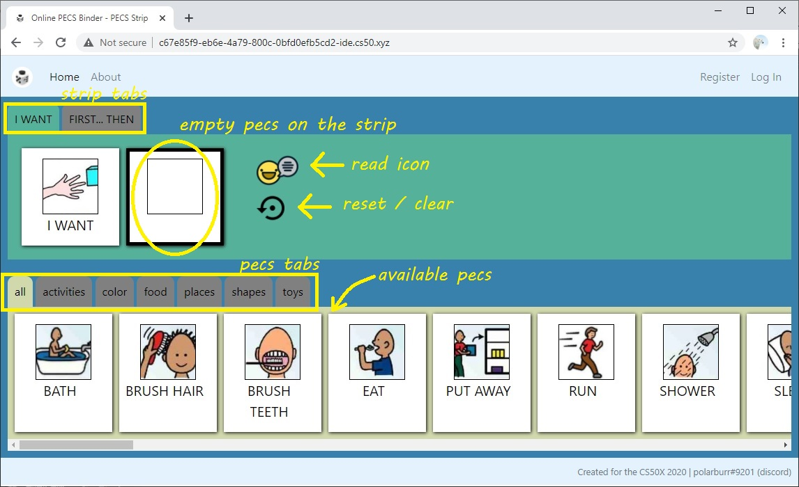
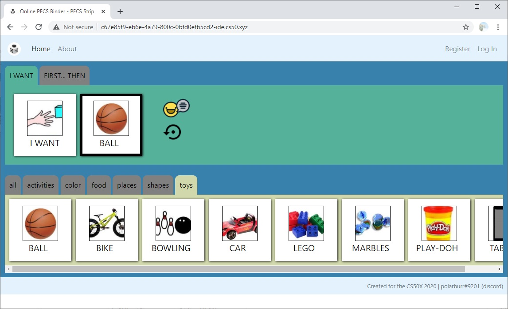
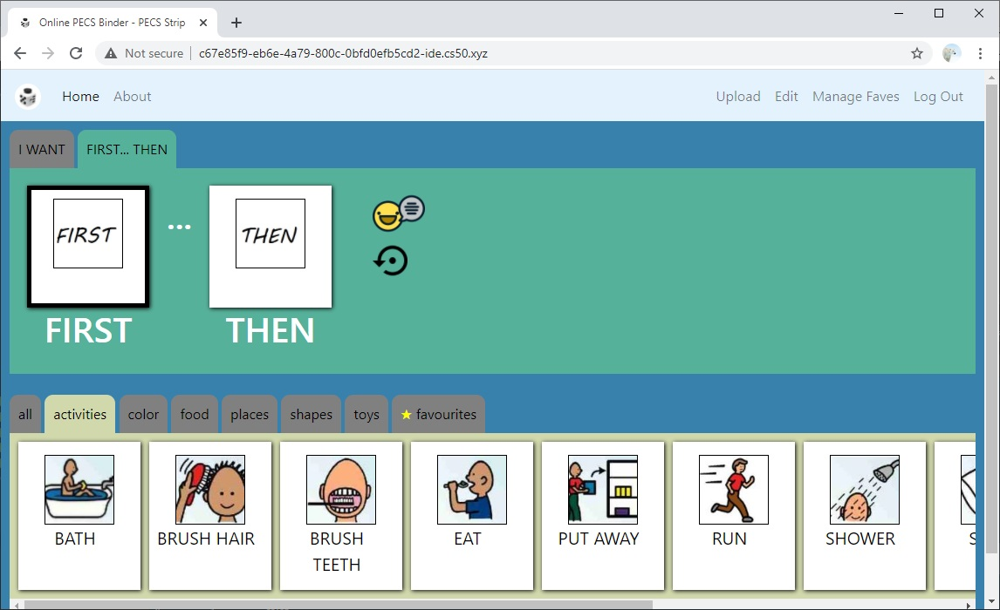
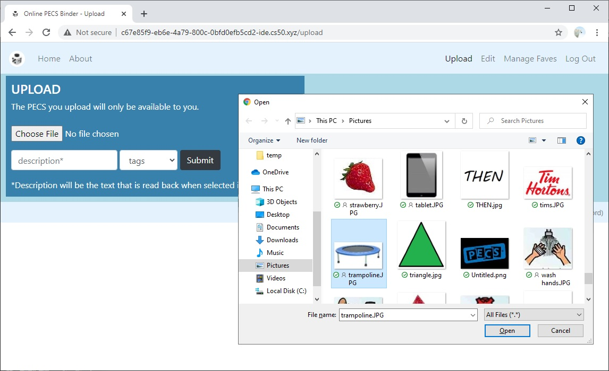
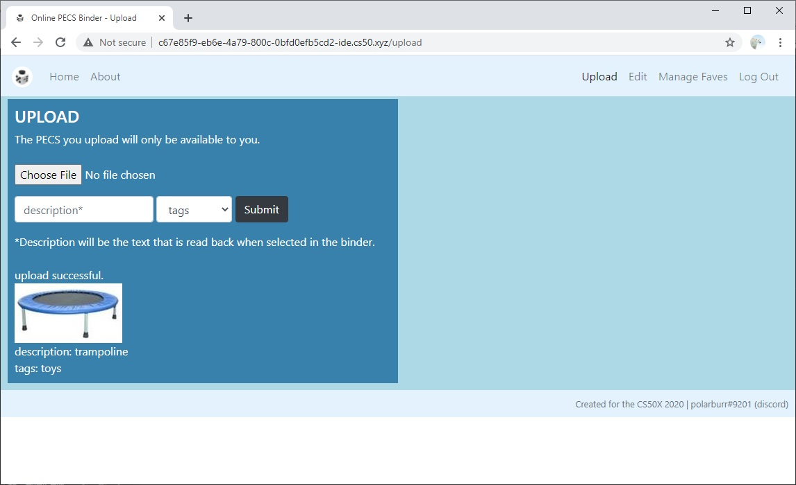
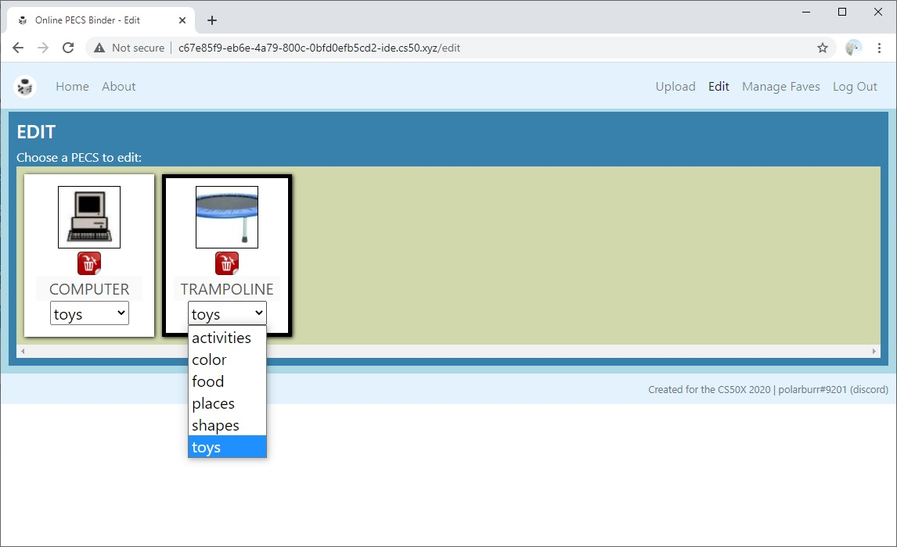
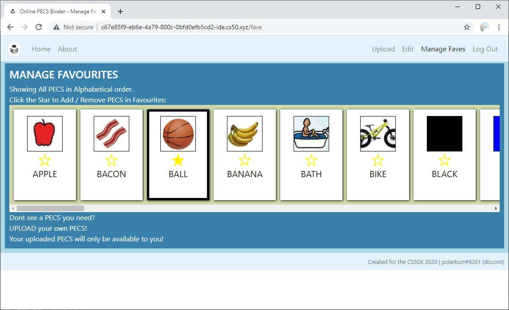
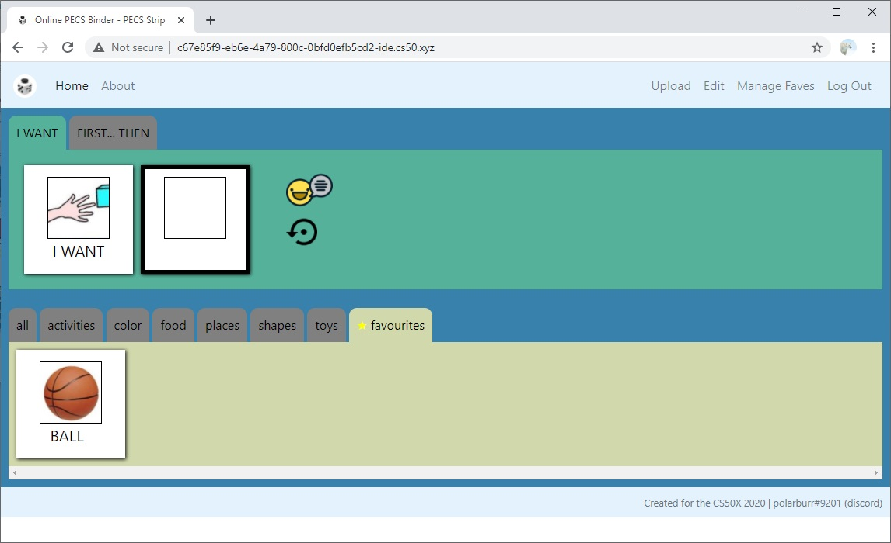

# Online PECS binder

<nobr>░█████╗░███╗░░██╗██╗░░░░░██╗███╗░░██╗███████╗  ██████╗░███████╗░█████╗░░██████╗</nobr> 
<nobr>██╔══██╗████╗░██║██║░░░░░██║████╗░██║██╔════╝  ██╔══██╗██╔════╝██╔══██╗██╔════╝</nobr> 
<nobr>██║░░██║██╔██╗██║██║░░░░░██║██╔██╗██║█████╗░░  ██████╔╝█████╗░░██║░░╚═╝╚█████╗░</nobr> 
<nobr>██║░░██║██║╚████║██║░░░░░██║██║╚████║██╔══╝░░  ██╔═══╝░██╔══╝░░██║░░██╗░╚═══██╗</nobr> 
<nobr>╚█████╔╝██║░╚███║███████╗██║██║░╚███║███████╗  ██║░░░░░███████╗╚█████╔╝██████╔╝</nobr> 
<nobr>░╚════╝░╚═╝░░╚══╝╚══════╝╚═╝╚═╝░░╚══╝╚══════╝  ╚═╝░░░░░╚══════╝░╚════╝░╚═════╝░</nobr> 

<nobr>  ██████╗░██╗███╗░░██╗██████╗░███████╗██████╗░</nobr> 
<nobr>  ██╔══██╗██║████╗░██║██╔══██╗██╔════╝██╔══██╗</nobr> 
<nobr>  ██████╦╝██║██╔██╗██║██║░░██║█████╗░░██████╔╝</nobr> 
<nobr>  ██╔══██╗██║██║╚████║██║░░██║██╔══╝░░██╔══██╗</nobr> 
<nobr>  ██████╦╝██║██║░╚███║██████╔╝███████╗██║░░██║</nobr> 
<nobr>  ╚═════╝░╚═╝╚═╝░░╚══╝╚═════╝░╚══════╝╚═╝░░╚═╝</nobr> 

..every readme should have an ascii text art..  
..polarburr#9201..

## TOC

  * [Abour](#About)
  * [Description](#Description)
    + [PECS Strips ( Home / Index )](#PECS Strips ( Home / Index ))
    + [Audio Feedback](#Audio Feedback)
    + [Sub-sub-heading](#PECS Strips ( Home / Index ))  
    
- [About](#About)
  * [Sub-heading](#sub-heading-1)
    + [Sub-sub-heading](#sub-sub-heading-1)    

## About

PECS stands for Picture Exchange Communication System. 
The PECS helps anyone with communication challenges, such as persons with Autism, communicate by exchanging pictures. 

PECS have different phases and The Online Binder is designed for use in the 4th Phase, 
where we are able to use an “I want” picture followed by a picture of the item being requested. 
Learn more about PECS from Pyramid Educational Consultants who developed the PECS - 
[https://pecs.com/picture-exchange-communication-system-pecs/](https://pecs.com/picture-exchange-communication-system-pecs/) 

## Description

The Website Application is designed to allow the use of the Binder even without registering. 
The PECS available are the generic items available to everyone. 
Registration will allow users of the application to upload their own PECS and add PECS to a favourites tab. 

### PECS Strips ( Home / Index )

The Interface is designed to be simple and resemble a PECS Binder with the I Want Strip at the top and the available PECS at the bottom 
The available PECS are all sorted in seperate tabs by their tags.  
For easy accessibility, the Available PECS are shown as large as possible and only occupy one row, scrollable in Y-axis. 
The Website is optimal in a wide-screen mode, such as on a tablet or any mobile device in landscape mode, or computer. 

#### Audio Feedback
Clicking on each of the PECS will play the audio of the PECS description. 
In the First..Then Strip, clicking on each of the boxes in the Strip will read that Box's sentence structure..  
i.e. Clicking the First Box will read "First,.." followed by the PECS description, if filled.  
Clicking on the Read icon which will read the whole sentence structure for both the I want and the First..Then strips. 

#### Strip Tabs

##### I Want Strip

The I Want Strip can be used by the individual to request for an activity or item. 
The PECS can be chosen by scrolling through the PECS tab then clicking on one of the available PECS, 
The chosen PECS then will automatically appear beside the I Want Picture. 

##### First .. Then Strip

The First .. Then strip is used to communicate with the individual and is useful to convey a sequence of events, 
i.e. First, an item or activity must be done, Then.. you can get the item or perform the next activity or task. 
The "First" Box is active by default (which can be recognized because of the black border), Choosing a PECS will fill the "First" Box. 
The active box will automatically move to "Then" after choosing a PECS, the next chosen pecs will fill up the "Then" Box. 

Clicking on any of the Boxes will change the active Box. Once an active box is chosen, you can change the current PECS by clicking another PECS. 
Alternately, the user can click the reset button to clear the Strip Boxes.
### PECS Strips ( Home / Index )

The Interface is designed to be simple and resemble a PECS Binder with the I Want Strip at the top and the available PECS at the bottom 
The available PECS are all sorted in seperate tabs by their tags.  
For easy accessibility, the Available PECS are shown as large as possible and only occupy one row, scrollable in Y-axis. 
The Website is optimal in a wide-screen mode, such as on a tablet or any mobile device in landscape mode, or computer. 

### Registered Users

Registered Users have the capaibility to 
- Upload / Edit
- Manage Favourites 

#### Upload

Upload allows a registred user to upload a PECS. 
The PECS will then appear with the rest of the Available PECS and will only be available to the person that uploaded the picture. 

Upon a successful upload, the PECS will be shown including the description and the tag. 
An audio for the description is automtically generated for the PECS. 
A database entry will be insderted containing the image's location, the description audio location, and the tag.  

#### Edit

Edit allows the user to change the Description and Tag of the PECS, or delete the picture. 
Clicking on the Description will provide a cursor to allow the user to change the description. 
Clicking on the tag will show all available tags in a drop-down. 
The changes, once made are saved to the database automatically and will not need any additional action to save. 
Only the PECS that the user has uploaded will be shown in this section. 

#### Manage Faves

PECS can be added to a favourite tab. 
All Available PECS, including the standard PECS will can be tagged in favourites. 
Clicking on an empty star will add the PECS to favourites, 
Clicking on a solid star will remove it from favourites. 

A Favourites tab will appear with all the PECS tagged as favourite. 
If there are no images tagged in Favourites, this tab will not be shown. 

## Project Resources

CS50 ide

The project was created in the CS50 ide environment and used the following libraries that were already available:
- [Werkzeug library](https://pypi.org/project/Werkzeug/)
- [CS50 library](https://cs50.readthedocs.io/libraries/cs50/python/)
- [Flask library](https://pypi.org/project/Flask/)
- [flask_session](https://pypi.org/project/Flask-Session/)
- [Jinja version 2.11](https://jinja.palletsprojects.com/en/2.11.x/)

Google Text to Speech

The Application uses Googles Text to Speech to generate the Audio files. 
The Google Text to Speech Package needs to be installed first in the ide to make the gTTx library available. 

Run the command from ide to install gTTs package

    $ pip install gTTS

Folder Structure

#### Root Folder

Contains the Python Code, helper functions and the database.

#### Static Folder

Sub-folder that contains items that are available to Flask Application, including css stylesheets

The Static Folder has the follwing sub-folders:
- [uploads] Will contain the uploaded images.
- [audio] Will comtain the generated audio files.

#### Templates Folder

Contains all the html files.

Database Schema

The application uses sqlite3 database.

#### User's Table

Table to store user information for registered users.

Special Users:
User 1 : Public - used to upload images available to unregistered and registered users.

    CREATE TABLE IF NOT EXISTS 'users' (
    'id' INTEGER PRIMARY KEY AUTOINCREMENT NOT NULL,
    'username' TEXT NOT NULL,
    'hash' TEXT NOT NULL
    );
    CREATE UNIQUE INDEX 'username' ON "users" ("username");

#### Image Table

Table to be used to store Image location.

    CREATE TABLE img(
    'id' INTEGER PRIMARY KEY AUTOINCREMENT NOT NULL,
    'name' TEXT NOT NULL,
    'desc' TEXT NOT NULL
    );

Sample Data
sqlite> select * from img;
| id  | name       | desc |
|-----|------------|------|
| 4   | black.jpg  | black|
| 5   | blue.jpg   | blue |
| 6   | brown.jpg  | brown|
| 7   | gray.jpg   | gray |

#### Tag Table

Table to store image tags references image table and user table.

    CREATE TABLE tag(
    'image_id' INTEGER NOT NULL,
    'user_id' INTEGER NOT NULL DEFAULT "0",
    'tag' TEXT NOT NULL DEFAULT "ALL",
    FOREIGN KEY(image_id) REFERENCES img(id),
    FOREIGN KEY(user_id) REFERENCES users(id)
    );

Sample Data
| image_id  |  user_id   |  tag         |
|-----------|------------|--------------|
| 4         |  1         |  color       |
| 5         |  1         |  color       |
| 52        |  1         |  places      |
| 53        |  1         |  places      |
| 54        |  1         |  places      |
| 55        |  1         |  places      |
| 34        |  104       |  favourites  |
| 44        |  104       |  favourites  |
| 35        |  104       |  favourites  |

## References
- [gTTS](https://gtts.readthedocs.io/en/latest/)
- [Bootstrap](https://getbootstrap.com)
- [jQuery](https://jquery.com/)
